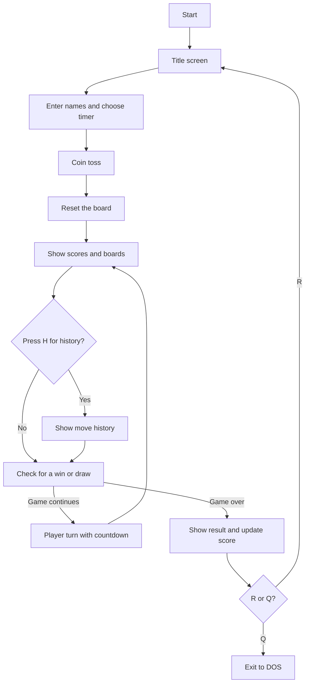

[Tic-Tac-Toe-README.md](https://github.com/user-attachments/files/33103659/Tic-Tac-Toe-README.md)
# Assembly Tic Tac Toe


**A two-player Tic Tac Toe game written entirely in 16-bit x86 assembly language.** It runs in a DOS text screen and goes well beyond the basic game: it has a coin toss to decide who starts, a countdown timer on every move, a running scoreboard, a full move history and instant rematches. All of it is built from BIOS and DOS interrupts, with no libraries.

Made by **AAA: Aryan, Ajwad and Amreen**.

## Table of contents

1. [Features](#features)
2. [How to play](#how-to-play)
3. [What the game looks like](#what-the-game-looks-like)
4. [Running the game](#running-the-game)
5. [How it works](#how-it-works)
6. [Code reference](#code-reference)
7. [Known issues](#known-issues)
8. [Ideas for improvement](#ideas-for-improvement)
9. [Team](#team)

## Features

| # | Feature | What it does |
| --- | --- | --- |
| 1 | **Player turns** | Two players take turns entering a position from 1 to 9. The screen shows whose turn it is and which mark they play. |
| 2 | **Coin toss** | A random toss, seeded by the system clock when you press a key, decides who plays X and starts. |
| 3 | **Winner detection** | After every move the game checks all 8 winning lines: 3 rows, 3 columns and 2 diagonals. |
| 4 | **Draw detection** | If all 9 squares are filled and nobody has won, the game ends in a draw. |
| 5 | **Move validation** | Anything that is not a free square from 1 to 9 is rejected with an "Invalid move" message. |
| 6 | **Move history and scores** | Every move is recorded and can be reviewed at any time. Scores carry over between rematches. |

**Extras**
- **Move timer.** Choose 10, 20 or 40 seconds per move. A live countdown is shown, and if it reaches zero the turn passes to the other player.
- **Custom player names** (up to 17 characters each).
- **Two grids side by side.** A numbered guide grid shows which key places a mark where, next to the live game board.
- **Rematch or quit** after every game.

## How to play

1. Press **SPACE** on the title screen.
2. Enter the names of Player 1 and Player 2.
3. Choose the time allowed per move: `1` = 10 seconds, `2` = 20 seconds, `3` = 40 seconds.
4. Press any key for the **coin toss**. The winner plays **X** and goes first.
5. On your turn, press a number from **1 to 9** to place your mark on that square:

   ```
    1 | 2 | 3
   ---+---+---
    4 | 5 | 6
   ---+---+---
    7 | 8 | 9
   ```

6. Get three of your marks in a row, column or diagonal to win. If the board fills up first, it is a draw.
7. When the game ends, press **R** for a rematch or **Q** to quit.

### Controls

| Key | Where | Action |
| --- | --- | --- |
| `SPACE` | Title screen and history screen | Continue |
| `1` `2` `3` | Timer menu | Choose 10, 20 or 40 seconds per move |
| Any key | Coin toss | Flip the coin |
| `1` to `9` | Your turn | Place your mark on that square |
| `H` | Before each turn and after the game | Show the move history |
| Any other key | Before each turn | Continue to the game |
| `R` | After a game | Rematch |
| `Q` | After a game | Quit |

## What the game looks like

Illustrative layout (the real spacing in the program may differ slightly):

```
CURRENT SCORES:
==============
Amreen: 1
Aryan: 0

Amreen (X) vs Aryan (O)

  Positions                 Game Board
  1 | 2 | 3                 X | O |
---+---+---        ---+---+---
  4 | 5 | 6                   | X |
---+---+---        ---+---+---
  7 | 8 | 9                   |   |

Amreen's turn (X). Position (1-9):

Time left: 14 seconds
```

## Running the game

The program is a single 16-bit assembly file. Use whichever tool you have. In the commands below, replace `tictactoe.asm` with the name of your source file.

### Option 1: emu8086

1. Open `tictactoe.asm` in [emu8086](https://emu8086.software.informer.com/).
2. Click **Emulate**, then **Run**.
3. Use the emulator's console window to play.

### Option 2: DOSBox with MASM or TASM

1. Install [DOSBox](https://www.dosbox.com/) and put your assembler (MASM or TASM) in a folder together with the source file.
2. In DOSBox, mount the folder, for example `mount c c:\asm` then `c:`.
3. Assemble, link and run.

   With MASM:
   ```
   masm tictactoe.asm;
   link tictactoe.obj;
   tictactoe
   ```

   With TASM:
   ```
   tasm tictactoe
   tlink tictactoe
   tictactoe
   ```

If your assembler complains about a missing memory model, add `.model small` as the very first line of the file.

## How it works

### Program flow



`main` runs the setup once (title, names, toss, reset), then loops: draw the screen, check whether the game is over, and if not, run one turn. When the game is over it shows the result and asks about a rematch.

### Key techniques

**Turn order from the coin toss.** The toss reads the BIOS clock tick counter (`INT 1Ah`) at the moment you press a key and uses its lowest bit, so the result is 1 or 2. That number is stored in `toss_winner`. The toss winner always plays X. `switch_player` flips `current_player` after each move and sets the mark to X if that player is the toss winner, otherwise O.

**The countdown timer.** Each turn copies `timer_limit` into `timer_count`. The turn loop then repeats: draw the number of seconds left, check whether a key is waiting (`INT 16h`, function 1), and if not, wait one second with the BIOS wait service (`INT 15h`, function 86h, 1,000,000 microseconds) and subtract one. When the count hits zero the turn is skipped and the other player goes next.

**A placeholder inside a message.** The turn prompt `'s turn ($). Position (1-9): $` contains a `$` that stands in for the mark. Because DOS function 9 prints until the first `$`, the program overwrites that placeholder byte with `X` or `O` before printing, so the same message works for both players.

**Move validation.** A key press is converted from its character to a number by subtracting `'0'`. The move is accepted only if the number is between 1 and 9 and the matching square on the board still contains a space. The number is stored as the last position so it can be written to the history.

**Winner and draw checks.** `check_game_over` compares squares directly in the 9-byte board array:
- Rows: squares starting at index 0, 3 and 6, comparing neighbours `+1` and `+2`.
- Columns: starting at index 0, 1 and 2, comparing `+3` and `+6`.
- Diagonals: indexes 0, 4, 8 and 2, 4, 6.
- Draw: no empty squares are left.

A line only counts if its first square is not a space. The winner is the player who moved *last*, which is the player before the one `switch_player` has just made current.

**Move history.** Three 9-byte arrays (`history_players`, `history_marks`, `history_positions`) store who moved, with which mark, and on which square. `record_move` writes at the index `history_count` and increments it. A game has at most 9 moves, so the arrays never overflow.

**Two grids side by side.** `display_boards` prints one character at a time with DOS function 2, writing the numbered guide grid and the live board on the same lines so players can see the position keys beside the real game.

### BIOS and DOS services used

| Interrupt | Function | Used for |
| --- | --- | --- |
| `INT 21h` | `AH=09h` | Print a `$`-terminated string |
| `INT 21h` | `AH=02h` | Print a single character |
| `INT 21h` | `AH=01h` | Read one character with echo |
| `INT 21h` | `AH=0Ah` | Read a whole line (player names) |
| `INT 21h` | `AH=4Ch` | Exit to DOS |
| `INT 16h` | `AH=00h` | Wait for a key press |
| `INT 16h` | `AH=01h` | Check if a key is waiting (timer loop) |
| `INT 10h` | `AH=00h` | Set text video mode 3, which clears the screen |
| `INT 10h` | `AH=02h` | Move the cursor (to show the countdown on its own line) |
| `INT 1Ah` | `AH=00h` | Read the clock tick counter (coin toss) |
| `INT 15h` | `AH=86h` | Wait a set number of microseconds |

## Code reference

The whole game lives in one source file with one data segment and one code segment.

### Data

| Variable | Meaning |
| --- | --- |
| `board` | The 9 squares, each `' '`, `'X'` or `'O'` |
| `num_board` | The fixed numbers `'1'` to `'9'` shown on the guide grid |
| `p1_name`, `p2_name` | Player names, filled by DOS buffered input |
| `current_player` | Whose turn it is, 1 or 2 |
| `current_mark` | The mark being played now, `'X'` or `'O'` |
| `toss_winner` | The player who won the coin toss and plays X |
| `timer_limit`, `timer_count` | The chosen seconds per move, and the seconds left this turn |
| `game_over`, `winner_player` | Game state flag, and the winner (0 means a draw) |
| `p1_score`, `p2_score` | Wins for each player |
| `history_players`, `history_marks`, `history_positions`, `history_count` | The recorded moves |
| `last_position` | The square chosen on the most recent move |

### Procedures

| Procedure | What it does |
| --- | --- |
| `main` | Runs the setup, then the game loop, then handles rematch or exit |
| `title_screen` | Shows the title and waits for SPACE |
| `get_player_names` | Reads both names and the timer choice |
| `coin_toss` | Picks the starting player and shows the result |
| `player_turn` | Shows the prompt, runs the countdown, reads and validates the move |
| `switch_player` | Passes the turn and sets the correct mark |
| `display_boards` | Prints the player line, the guide grid and the game board |
| `check_game_over` | Checks all rows, columns, diagonals and the full-board draw |
| `set_winner` | Records who won |
| `display_result` | Shows the winner or the draw and updates the score |
| `ask_replay` | Asks for R or Q and returns the answer to `main` |
| `check_history_option` | Offers the move history before each turn |
| `reset_game` | Clears the board and history and gets the game ready |
| `record_move` | Stores one move in the history arrays |
| `display_score` | Prints both players' scores |
| `display_history` | Prints the full list of moves and waits for SPACE |
| `clear_screen` | Clears the screen using video mode 3 |

## Known issues

These are small quirks in the current version that a future update could fix:

- **Invalid moves.** After an "Invalid move! Try again" message, the first key you press is read and ignored before the game waits for your move, so you may need to press your position twice. The countdown also stays paused while you retry.
- **Scores are single digits.** The scoreboard prints each score as one character, so it shows correctly up to 9 wins.
- **Rematch starts from the title screen.** You enter names and the timer again, and the scores carry over between games. If you type different names, the old scores stay.
- **History prompt on every turn.** The "Press H to view history" prompt waits for a key before each move.

## Ideas for improvement

- Remove the extra key read after an invalid move and keep the timer running
- Show scores with more than one digit
- Add a "play again" option that keeps names and timer settings
- Add a single-player mode against the computer
- Highlight the winning line on the board
- Add colour using video attributes or `INT 10h` text colouring

## Team

Built by **AAA**. Each member wrote and documented two of the six features:

| Member | Features |
| --- | --- |
| Aryan Rahman Mugdha | 1. Player turns, 2. Coin toss |
| Ajwad Ahnaf | 3. Winner detection, 4. Draw detection |
| Amreen Hassan | 5. Move validation, 6. History and scores |
